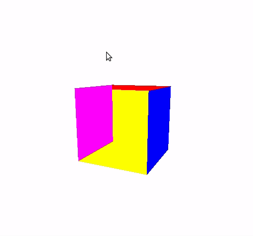
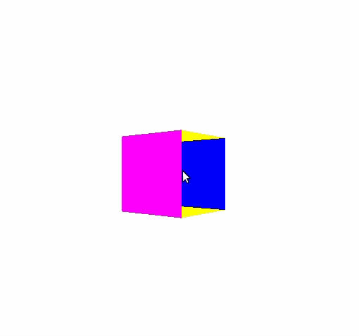
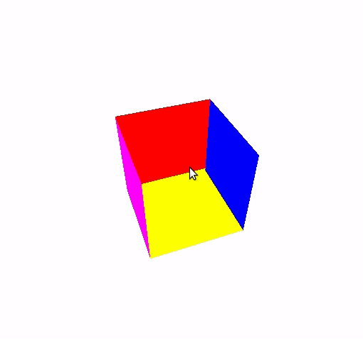
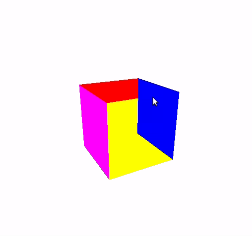
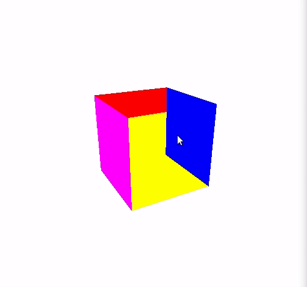

## Laboratorio 4 (scene)
* **HOME** - La cámara vuelve a la situación inicial
* **F1** - Desactivar cualquier modo de movimiento de cámara
* **F2** - MODO EXAMINAR

* **F3** - MODO CAMINAR

* **F4** - El modo de proyección entre ORTOGONAL y PERSPECTIVA.

* **F5** - MODO TRÍPODE

* **F6** - MODO PAN

