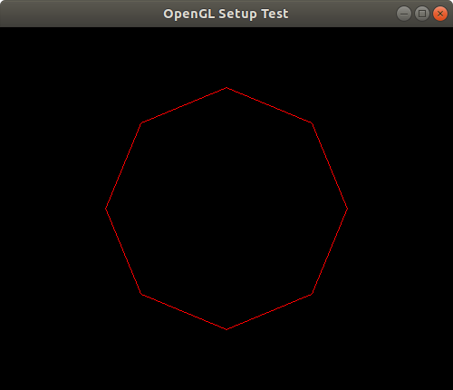
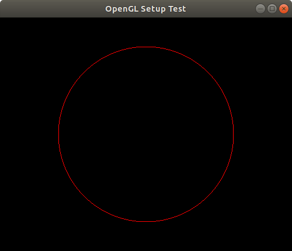

## Ejercicio 2.4

### 2.4.1
Escriba un programa (en C) que dibuje un polıgono regular (es decir, un polıgono con lados de longitudes iguales y ángulos internos iguales) con un radio igual a un tercio de la altura de la pantalla, y centro en el centro de la pantalla. El programa debe solicitar el número de vértices, n.

  ##### SOLUCIÓN
  [Código fuente 2.4.1](poligono241.cpp)
  ##### CAPTURAS
  
  

### 2.4.2
Modifique el programa del ejercicio anterior para solicitar también el radio r del circulo que circunscribe el poligono. Haga que su programa estime el número n de vértices necesarios para que el poligono parezca una "buena aproximación" para un circulo. Utilizando los parámetros ndh, ndv, width, height del dispositivo, obtenga una relación teórica entre n y r para la aproximación de circulos a través de poligonos.

  ##### SOLUCIÓN
  La relacion teorica entre los parametros ndh, ndv, width, height del dispositivo se dan mediante la formula de la circunferencia, de la siguiente forma:
  Para ndh = width y ndv = height se cumple.
  ```bash
      n = 2*pi*(ndh/width*r)
      or
      n = 2*pi*(ndv/height*r)
  ```
  
  [Código fuente 2.4.2](poligono242.cpp)
  ##### CAPTURAS
  


### 2.4.3
Algunos dispositivos vectoriales ofrecen un conjunto de tres primitivas gráficas:

  * pen_up: levanta la pluma del papel, o apaga el haz de electrones;
  * pen_down: coloca la pluma sobre el papel, o conecta el haz;
  * locate(dcx, dcy): coloca la CP en un punto del rectángulo de visualización.

Escriba rutinas de software que simule estas tres primitivas, usando las primitivas de moveto y drawto.

  ##### SOLUCIÓN
  ```bash
    pen_up {
            moveto(CP.dcx, CP.dcy);
    }
    
    pen_down {
            drawto(CP.dcx, CP.dcy);
    }
    
    locate(dcx,dcy) {
            moveto(dcx, dcy);
    }
  ```
  
### 2.4.4
Calcule las razones de aspecto (gráfica y fısica), y las resoluciones de área horizontal y vertical de una pantalla de TV a color estándar, donde:

   * width = 42cm;
   * height = 31cm;
   * ndh = 546;
   * ndv = 434.
   
  ##### SOLUCIÓN
  1. Tamaño punto horizontal: horiz_dot_size = width/ndh = 420/546.
  2. Tamaño punto vertical: vert_dot_size = height/ndv = 310/434.
  3. Resolución horizontal: horiz_res = ndh/width = 546/420.
  4. Resolución vertical: vert_res = ndv/height = 434/310.
  5. Total puntos direccionables: total_nr_dots = ndh \* ndv = 546 \* 434.
  6. Resolución de área: área res = total_nr_dots/(width \* height) = (546 \* 434)/(420 \* 310).
  7. Razón de aspecto gráfico: aspect_ratio = vert_dot_size/horiz_dot_size = (310/434)/(420/546).
  8. Razón de aspecto fısico: physical_aspect_ratio = height/width = 310/420.
